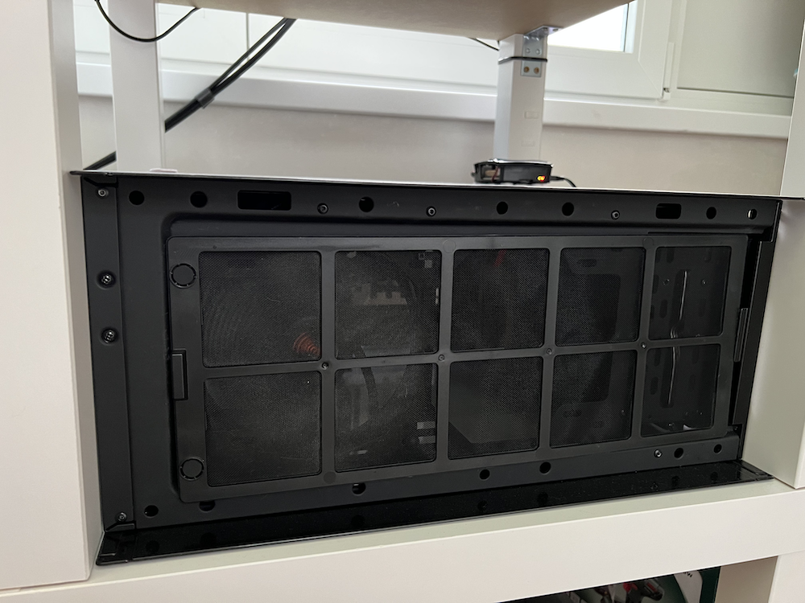
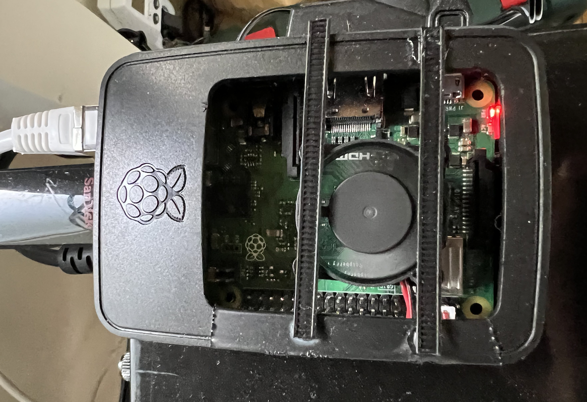
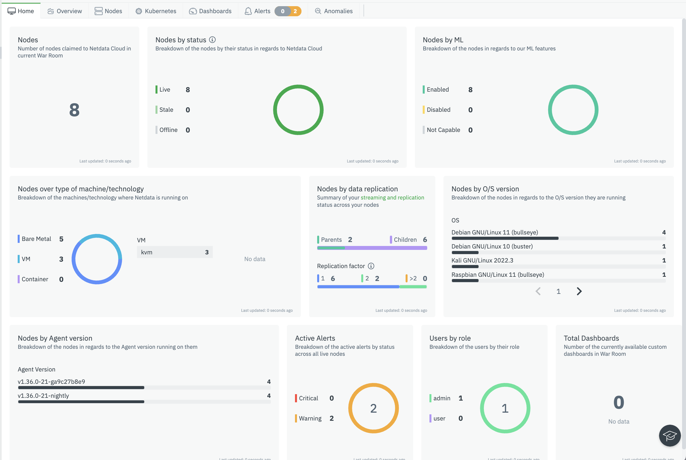

If I remember correctly, it all started with a post on Reddit around 2 years ago where someone mentioned Proxmox and peaked my curiosity. I had an old PC laying around the house and decided to give it a go. To be honest, at the time I wasn't that captivated by it even though I saw how useful it could be for someone actually needing it. Of course, I wasn't familiar with the whole HomeLab concept. 

Cue April 2022, when I decided to give Proxmox a go again to host my NAS and a local web-page for a small project I did [(See it here)](https://github.com/mihnearad/CoffeeProject). After that, I was captivated by it and started treating it as a hobby. Also ended up using some knowledge from that in my job. 

## Let's go through the hardware first

**The "Host"** - *Custom PC built on older parts*

- 32GB Ram DDR4 2600Mhz
- Intel i7-6700 4 core 8T cooled with BeQuiet Dark Rock Pro 4 (overkill but I had it around the house)
- Around 2TB of SSD Space, 1.5Tb is used for NAS and Plex (more on that later)

**The "Firewall"** - *Dell Optiplex 7040*

- 24GB RAM DDR4 2600Mhz
- Intel i5-6600 4 core CPU
- Around 500GB for VM's and OS space

**The "Soldier"** - *Old Gaming PC*

- 64GB RAM DDR4 3600MHZ
- AMD 5900X 
- GTX 970 (sold my RTX3090FE when I stopped gaming)
- 3TB SSD Space 
- 4TB HDD Space

**Tenda 8 Port Gigabit Switch** - need to go for a managed switch asap. 

**Apple Time Capsule 3TB** - had it around the house and I use it for non-essential files/pictures/backups

**Raspberry Pi 3B+** used as a Quorum for Proxmox

**Lenovo IdeaPad** - used for NetData Monitoring and Kali Linux

**UPS from APC** - connected to network for monitoring

**UPS from CyberPower** - connected to network for monitoring

Now that we have the hardware out of the way, we can discuss each piece of software/tools that I have on my cluster. To be mentioned that the "Soldier" does not have Proxmox on it and is running Windows with multiple VM's on HyperV. 

### Software and Tools

**Proxmox Cluster**
1. The Host
2. The Firewall
3. Raspberry Pi Quorum  

**The main Node, the "Host" holds the following:** 

1. **Docker Container** - holds Dashy on it to display a local Dashboard for the Homelab
2. **Guacamole** - browser RDP connection client for my machines. Not used very often but I liked the idea
3. **CoffeeProject** - this project over here
4. **OpenMediaVault** - OS for my NAS with the following containers on it
    * *Sabnz* - usenet download client
    * *Sonarr* - used for downloading TV series
    * *Radarr* - used for downloading Movies
    * *Plex* 

**The Firewall:**

1. **OpnSense** with OpenVPN activated 
2. **PiHole** 
3. **Smokeping** - used to check latency to different hosts. I use it to check latency to my local machines to make sure the connection is stable as well as to Google DNS, OpenDNS and my ISP's DNS to monitor which one is fastest. 

### Monitoring

I use NetData Cloud to monitor all the VM's and Bare Metal servers to make sure nothing breaks down. It's sending emails automatically with anomalies or errors it encounters. In the future I plan to also deploy a Firewall log monitoring tool such as ELK or Grafana. 

