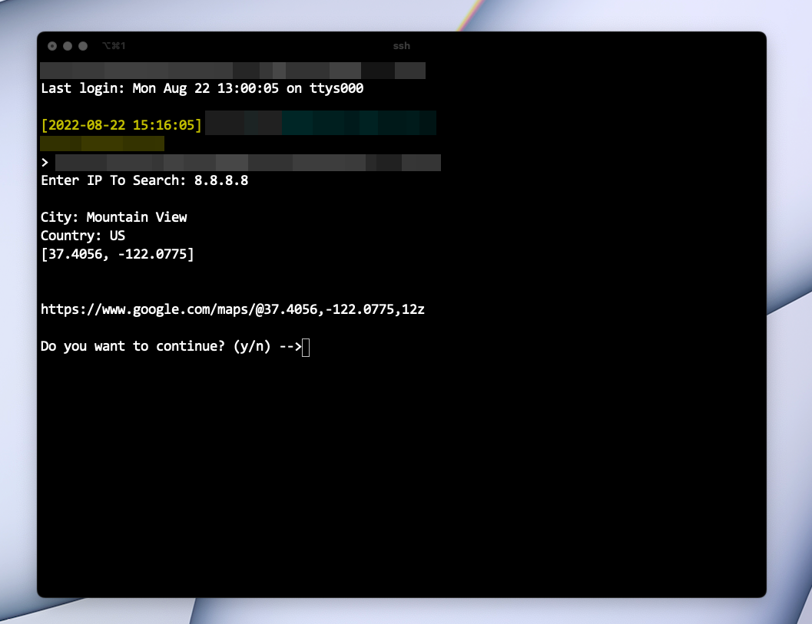

I am the first one to admit that I am quite peculiar when it comes to the hardware I work with. Let me explain. I like keeping my machines "clean" both on the outside and on the inside. That means that I avoid installing things that I don't need on a regular basis and if I can find an alternative, I will. For example, I have written few python scripts, nothing complex, but that would help me in my daily tasks. I developed the scripts on a UbuntuVM running on my HyperV machine. Well, when I moved the script over to my Mac machine, I had to install few dependencies, which I didn't like. See, these scripts are still in the early stages, and I might not use them that much in the beginning or might use them daily, time will tell. I didn't want to keep installing modules, packages, etc on my daily driver and then forget about them. 

### Here comes the solution:

I quickly spun up a VM on my Proxmox node with Ubuntu 22.04, installed CodeServer and Git on it and quickly deployed a simple script as a proof of concept and managed to run it through the ssh command. I had few doubts as the script needs user input so I wasn't sure if it would work or crash. But, to my surprise, it worked on first try. As a result, I can now run any script on the Script-VM created for this purpose by clicking just one file.

The script I used to test this principle can be found here: [GeoIP Locator](https://github.com/mihnearad/geo-ip-location)

