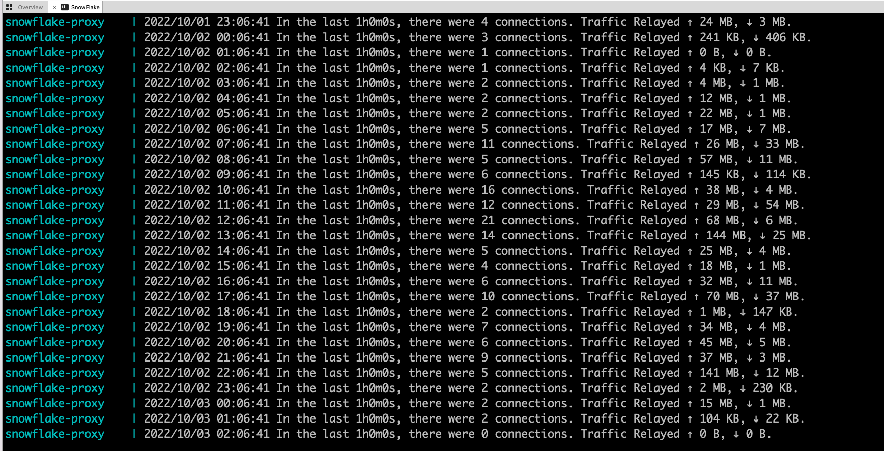

I recently came across an article on Twitter about how a snowflake node could help the Iranian population bypass government censorship. However, in the article it was just barely grazing on the self-hosted option as it was focused more towards the browser add-on. 

You can find more about the Snowflake project [here](https://snowflake.torproject.org/). In essence, it's a system that masks internet traffic to make it appear as a regular video/voice call. It benefits greatly on the number of nodes that exist in the network, so the more the merrier. 

An alterantive to the browser add-on, you can either embed Snoflake on your website (as I did below) or run it as a docker container on a server. 

<iframe src="https://snowflake.torproject.org/embed.html" width="420" height="240" frameborder="0" scrolling="no"></iframe>

I followed this tutorial to install it on my Ubuntu VM hosted on Proxmox -> https://community.torproject.org/relay/setup/snowflake/standalone/

To summarize, you need to have Docker and Docker-compose installed and then run:

`docker-compose up -d snowflake-proxy`

After the setup is done and the container is working, we can see the connection logs by running: 

`docker-compose logs -f snowflake-proxy`

